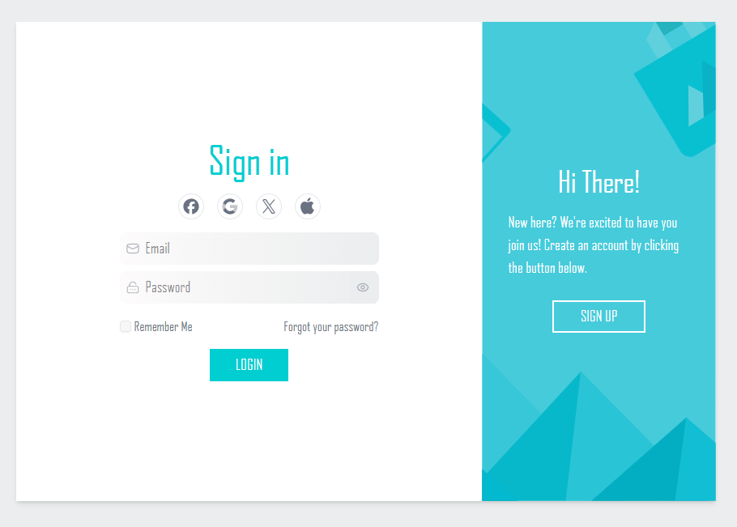

# Modern Authentication UI

A sleek and modern authentication interface built with React, TypeScript, and TailwindCSS. The UI features a sliding animation between sign-in and sign-up forms with a dynamic sidebar overlay.



## Features

- 🎨 Modern and responsive design
- 🔄 Smooth sliding animations using Motion
- 🔐 Sign in and sign up forms
- 🎭 Password visibility toggle
- 🌐 Social media authentication options
- 📱 Forgot password workflow
- ✨ Custom UI components
- 🎯 Fully TypeScript support
- 🎯 Tailwind CSS for styling

## Tech Stack

- React
- TypeScript
- Tailwind CSS v4
- Framer Motion (for animations)
- Vite
- Radix UI (for accessible components)

## Getting Started

### Prerequisites

- Node.js (v18 or higher)

### Installation

1. Clone the repository:

```bash
git clone https://github.com/EL-OUARDY/auth-ui.git
cd auth-ui
```

2. Install dependencies:

```bash
npm install
```

3. Start the development server:

```bash
npm run dev
```

4. Open your browser and visit `http://localhost:3000`

## Project Structure

```
src/
├── components/
│   ├── auth/         # Authentication related components
│   ├── icons/        # SVG icons components
│   └── ui/           # Reusable UI components
├── lib/
│   └── utils.ts      # Utility functions
└── assets/
    ├── fonts/        # Custom fonts
    └── img/          # Images and shapes
```

## Contributing

1. Fork the repository
2. Create your feature branch (`git checkout -b feature/amazing-feature`)
3. Commit your changes (`git commit -m 'Add some amazing feature'`)
4. Push to the branch (`git push origin feature/amazing-feature`)
5. Open a Pull Request
